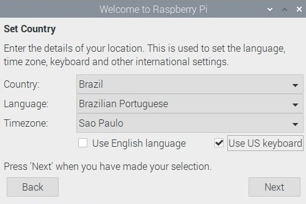
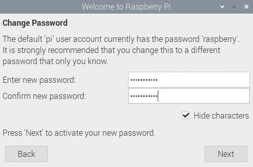
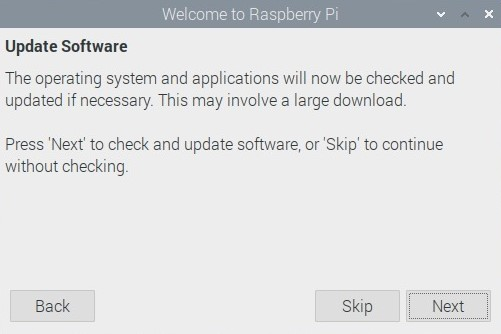
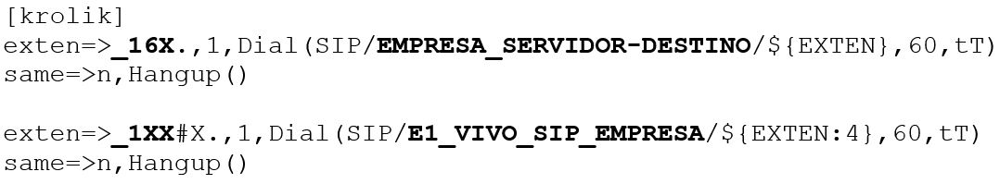
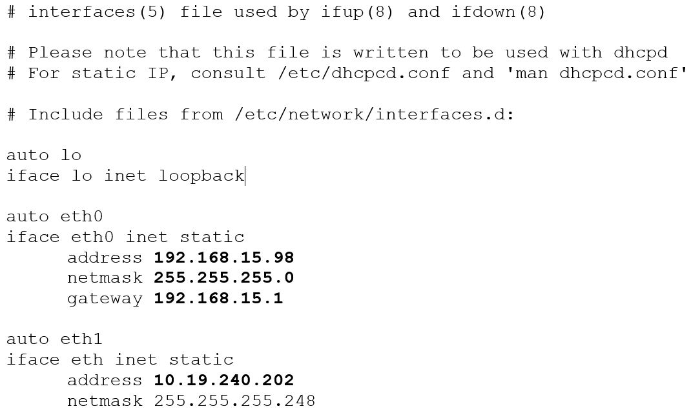
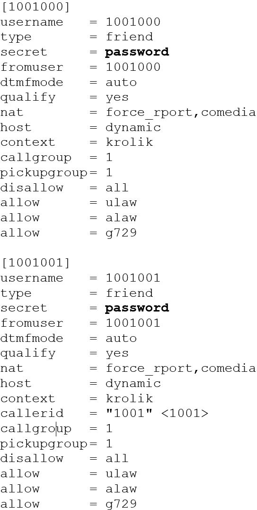
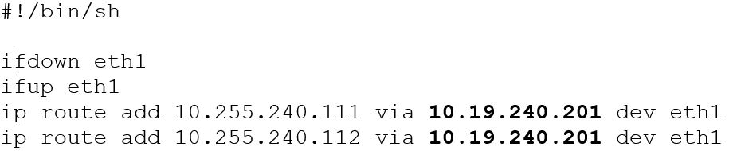
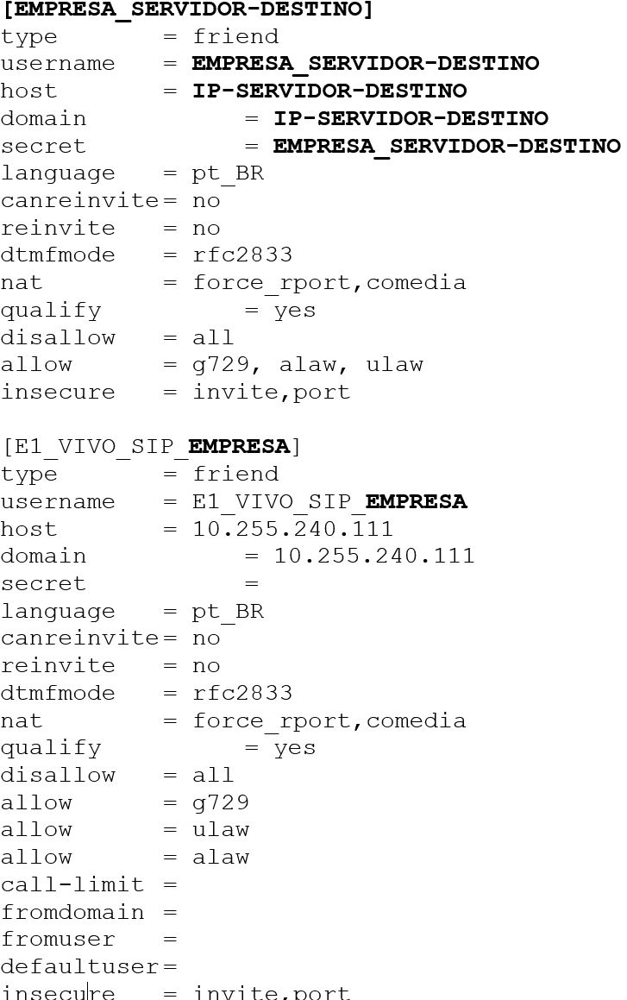
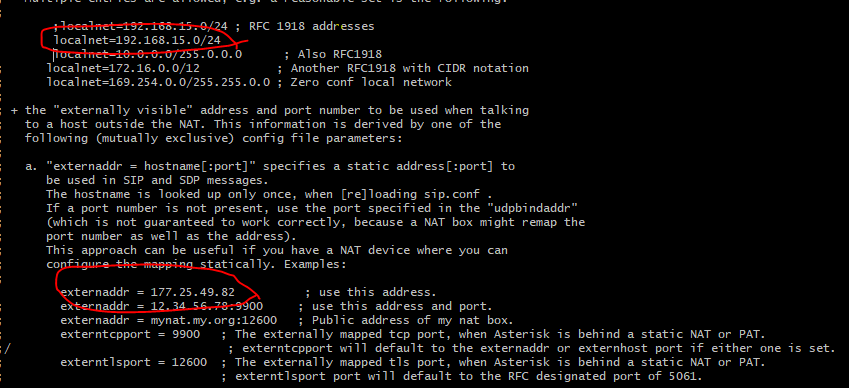

<h1>Gateway E1</h1>
    <h2>🚀 Tecnologias utilizadas</h2>
    <ul>
        <li>Raspberry PI O.S</li>
        <li>Asterisk</li>
        <li>Shell Script</li>
    </ul>
    <h2>🎬 Começando...</h2>
    
Essas instruções fornecerão uma cópia do projeto completo instalado e funcionando em seu raspberry
        para fins de desenvolvimento e teste.
    

    <h2>Passo 1 - Configurando o idioma</h2>
    
Na opção "Country" iremos definir o pais <strong>Brazil</strong>, logo após na opção "Language" iremos escolher
        <strong>Brazilian Portuguese</strong>
        e na opção "Timezone" iremos escolher <strong>São Paulo</strong> e por fim marcaremos a opção "Use US keyboard",
        logo após iremos dar next, como mostra o exemplo abaixo.

    
    <h2>Passo 2 - Criando senha</h2>
    
Neste passo iremos criar uma senha, confirmar a senha e logo em seguida escolher a opção next. 

    

    <h2>Passo 3 - Atualizando o software</h2>
    
Neste passo iremos apenas selecionar a opção next.

    

    <h2>Passo 4 - Console Raspberry</h2>
    
Assim que estiver acessando o raspberry é necessário que o serviço do SSH
        seja reiniciado para que você possa acessar o raspberry da sua maquina remotamente.
    

    
<b>Credenciais de acesso ao Raspberry:</b>

    
Usuário: pi
         Senha: ******* (Senha que você definiu no passo anterior.)
    

    
<b>Reiniciando o serviço do SSH</b>

    
sudo /etc/init.d/ssh restart

    
<b>Instalando o editor de textos Vim</b>

    
sudo apt install vim

    <h2>Passo 5 - Como baixar?</h2>
    <ul>
        <li>Para baixar o projeto siga as instruções abaixo:</li>
        
1. cd /usr/src/
             2. git clone https://github.com/leoolopes01/gateway-e1-raspberry-asteriskv13.git
             3. Será necessário realizar alterações nos arquivos de configuração
        

    </ul>
    

    <h2>Passo 6 - Alterando arquivos</h2>
    

    <h3>Iremos acessar o arquivo <strong>extensions</strong> dentro da pasta "gateway-e1-raspberry-asteriskv13"
        e iremos alterando somente as partes em negrito como mostra a imagem.</h3>
    

    <ul>
        <li>Alterar o "_16X" pelo número do DDR do cliente, Ex:_16202160XX</li>
        <li>Alterar o "EMPRESA_SERVIDOR-DESTINO" pelo nome da empresa e nome do servidor trunk</li>
        <li>Alterar o "_1XX" para o código da empresa que está sendo instalado o raspberry no trunk</li>
        <li>Alterar o "E1_VIVO_SIP_EMPRESA" para o nome da empresa, e caso a empresa fornecedora do E1 seja outra
            não esqueça de alterar, Ex: "E1_EMBRATEL_SIP_JOAOZINHO_MATERIAIS"
        </li>
    </ul>
    <h3>Feito isso iremos alterar o arquivo <strong>interfaces</strong> dentro da pasta
        "gateway-e1-raspberry-asteriskv13"
        e iremos novamente alterar somente as partes em negrito como mostra a imagem.</h3>
    

    <ul>
        <li>Alterar a eth0 (address, netmask, gateway) para as configurações de rede da empresa cujo Raspberry será
            instalado</li>
        <li>Alterar o IP da eth1 (address) pelo IP do E1 (Recebido pela operadora do E1. Geralmente "IP PABX")</li>
    </ul>
    <h3>Em seguida iremos alterar o arquivo <strong>sip-peers</strong> dentro da pasta
        "gateway-e1-raspberry-asteriskv13"
        e iremos novamente alterar somente as partes em negrito como mostra a imagem.</h3>
    

    <ul>
        <li>Alterar para uma senha <strong>difícil</strong> (Ex. J0A0KMSn86GssXsc7) e após finalizar a instalação do E1
            pode-se remover todo o conteúdo de escrita existente neste arquivo.</li>
    </ul>
    <h3>O próximo passo é alterar o arquivo routes dentro da pasta "gateway-e1-raspberry-asteriskv13" e iremos
        novamente alterar somente as partes em negrito como mostra a imagem. </h3>
    

    <ul>
        <li>Alterar o <strong>10.19.240.201</strong> para o gateway do E1. (Recebido pela operadora do E1)</li>
    </ul>
    <h3>E por ultimo devemos alterar a pasta sip-trunk dentro da pasta "gateway-e1-raspberry-asteriskv13" e iremos
        novamente alterar somente as partes em negrito como mostra a imagem.</h3>
    

    <ul>
        <li>Alterar as palavras em negrito para as informações do cliente.</li>
    </ul>
    

    <h3>Iremos acessar o arquivo <strong>sip.conf</strong> dentro da pasta "gateway-e1-raspberry-asteriskv13"
        e iremos alterar o <strong>externaddr</strong> para o IP externo e o <strong>localnet</strong> para o ip da rede interna.</h3>
    

    <h2>Passo 7 - Como instalar?</h2>
    

    <ul>
        <li>Para instalar o projeto siga as instruções abaixo</li>
        
1. Dar permissão de execução para o raspInit.sh usando o comando abaixo: <strong>sudo chmod 777 raspInit.sh</strong>
        

        
2. Executar o script com o comando abaixo: <strong>sudo ./raspInit.sh</strong>

    </ul>
